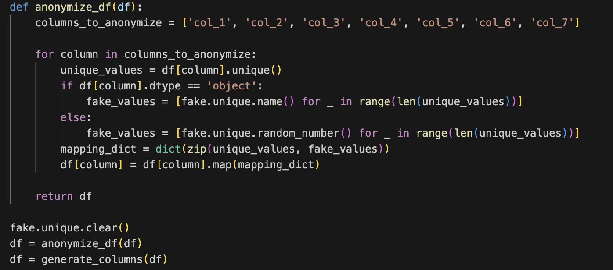

```{css, echo=FALSE}
body {
  font-family: 'Verdana', sans-serif;
}

#footer {
position: fixed;
left: 0;
bottom: 0;
width: 100%;
background-color: #f2f2f2; /* You can change the background color */
  color: black; /* Text color */
  text-align: center;
padding: 10px 0;
font-size: 1.2em;
}

```

------------------------------------------------------------------------

------------------------------------------------------------------------

# **Note:**

#### - The information shown here is made-up. I made it with random numbers and names using the Python code you can see below. While the data is not real, it is designed to be a hypothetical yet realistic representation of actual data encountered in the field.

<br>



<br>

#### - In summary, I've employed logistic regression to successfully predict the likelihood of high turnover rates at various plants using explanatory variables related to hiring and attritions, such as external openings, temp positions filled, and new hires/terminations across various fiscal years.

<br>

------------------------------------------------------------------------
